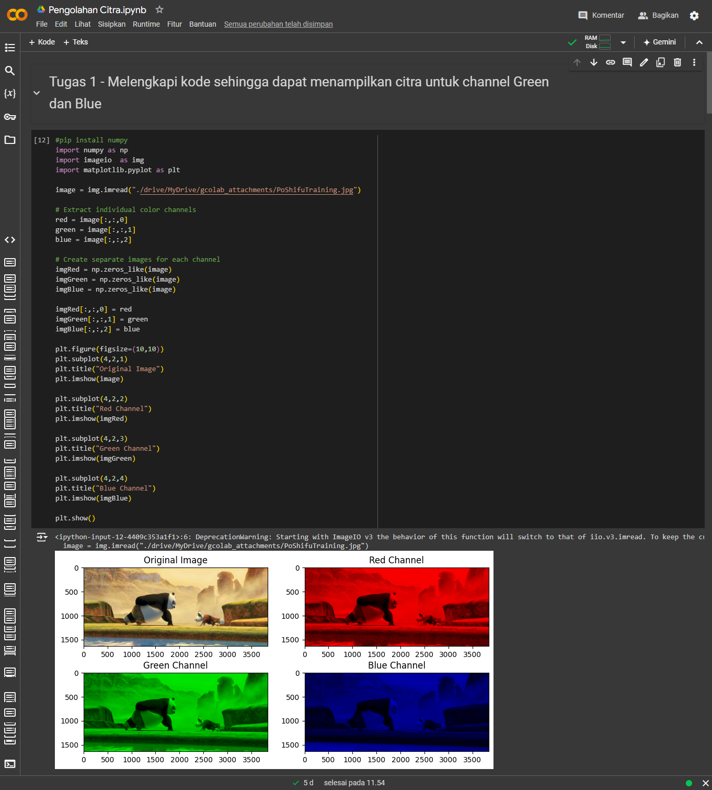

# Tugas 1 Pengolahan Citra

## Pendahuluan

- **Bahasa Pemrograman:** [Python]
- **Tool:** [GoogleColab]

## Implementasi

- **Kode:**
  - Kode program dapat dilihat pada file `main.py` atau pada tautan google colab berikut [Tugas 1 Pengolahan Citra](https://colab.research.google.com/drive/1Pln0v8ZhMfp57R2XpimhG34mV0fmi_SB?usp=sharing).
- **Penjelasan Singkat:**
  - Pada percobaan ini, kita melakukan pemisahan kanal warna pada sebuah citra RGB. Pertama-tama, citra dibaca dan dipecah menjadi tiga komponen warna dasar, yaitu merah, hijau, dan biru. Kemudian, tiga citra baru dibuat, masing-masing hanya berisi satu kanal warna. Dengan menggunakan pustaka Matplotlib, citra asli dan ketiga citra hasil pemisahan kanal warna tersebut kemudian ditampilkan secara berdampingan untuk visualisasi. Proses ini memungkinkan kita untuk menganalisis kontribusi setiap kanal warna terhadap warna keseluruhan suatu citra.

## Hasil

- 

## Author

- Ahmad Sidik Rudini
- 220401020034
